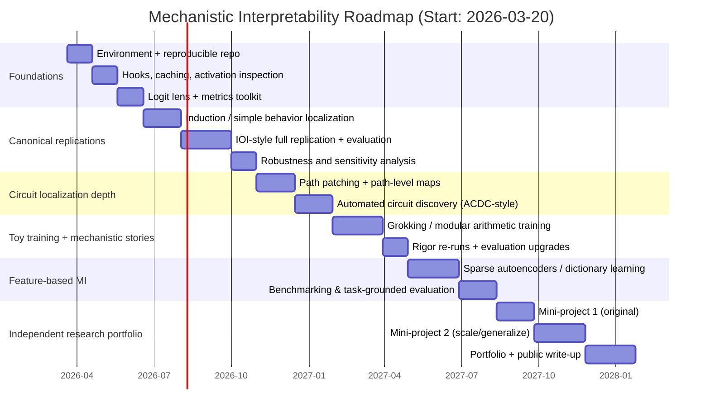

# Roadmap to Expert-Level Mechanistic Interpretability

## Executive Summary

Mechanistic interpretability (MI) aims to reverse-engineer trained neural networks into **explicit, testable internal mechanisms**—“circuits,” algorithms, and causal pathways—rather than treating the model as a black box. Modern MI work spans (a) localizing model behavior via causal interventions (activation/patching families), (b) building mechanistic explanations that satisfy quantitative criteria, and (c) extracting more interpretable internal “features” using sparse dictionary-learning methods such as sparse autoencoders (SAEs). citeturn23search0turn16search7turn17search21turn12search5

Because you already understand transformer architecture, the fastest path to expertise is not another tour of attention/MLPs; it’s a **skill progression**:

1) learn MI’s core “objects” (residual stream decompositions, head outputs, MLP activations, logits as readouts),  
2) master **reproducible causal experiments** (patching, ablation, path patching, causal scrubbing),  
3) build the habit of **evaluation discipline** (faithfulness/completeness/minimality, sanity checks, benchmarks with ground truth when possible),  
4) scale your practice from toy models to mid-sized open models and from “streetlight tasks” to broader behaviors. citeturn23search0turn16search5turn23search1turn2search23turn16search2

This report provides a 12–18 month, step-by-step plan that emphasizes: (i) canonical papers and threads, (ii) concrete experiments you can re-run and extend, (iii) model/task choices that keep compute manageable, (iv) tooling centered on **TransformerLens**, **Ecco**, **Captum**, **PyTorch**, **JAX**, and **Hugging Face**, and (v) a research-workflow template geared for publishable rigor. citeturn21search14turn21search0turn21search15turn20search1turn20search2

Assumptions (explicit because you did not specify constraints): you can spend **8–12 hours/week**, you are comfortable coding in Python, and you will start with **single-GPU** workflows (local or rented). If you have less time (e.g., 4–6 hrs/week), extend the timeline toward 18 months; if you have more time (15–20 hrs/week), you can compress toward 9–12 months but should keep the same “gates” (replications → controlled extensions → original projects). citeturn16search7turn15search8

## Assumptions, prerequisite gaps, and target competencies

You said you know transformer architecture. The usual “hidden prerequisites” MI learners discover late—and should therefore check early—cluster into four categories:

**Programming + debugging depth (gap often unspecified):** comfort with model-internals tooling (forward hooks, caching activations, shape discipline, mixed precision pitfalls). MI work frequently requires capturing and editing intermediate activations at exact sites in the forward pass; tooling like hook points formalizes this, but you still need strong debugging habits. citeturn21search6turn21search14turn20search3

**Causal reasoning in model space (gap often unspecified):** distinguishing correlational probes/visuals from causal claims. “Mechanistic” in the narrow technical sense often implies *causal* claims or interventions; MI papers increasingly stress evaluation methodology because superficially plausible explanations can fail under stricter tests. citeturn17search21turn16search5turn23search0turn23search1

**Interpretability-method literacy (gap often unspecified):** knowing what each family can/cannot justify. For example, attribution/attention visuals can be misleading without sanity checks; the broader interpretability literature documents such failures, motivating more rigorous evaluation. citeturn11search1turn11search0turn23search3

**Reproducible research practice (gap often unspecified):** MI is experiment-heavy and frequently “notebook-driven,” so rigor depends on versioning, experiment logs, and stable artifacts. Community reproducibility handbooks and templates exist and are worth adopting from day one. citeturn11search11turn11search31turn18academia34

### Competencies to reach “expert level” by month 12–18

A practical definition of “expert MI” (as opposed to “familiar with MI”) is that you can repeatedly do all of the following:

- **Reproduce** at least 2–3 canonical circuit/feature results (not just run code) and explain why each evaluation criterion is satisfied (or where it fails). citeturn23search0turn23search1turn2search23turn12search2  
- **Design and run** causal localization experiments (activation patching variants; path patching; ablations) and justify why your metric + corruption scheme is appropriate, since these choices can change conclusions. citeturn16search5turn2search23turn23search0  
- **Produce a mechanistic claim** that survives skeptical checks: robustness across prompt variants/distributions, ablation/patching consistency, and at least one evaluation benchmark or ground-truth testbed where feasible. citeturn16search2turn23search0turn16search5turn11search1  
- **Operate across abstraction levels:** neuron/feature-level (SAEs / dictionary learning), head/path-level circuits, and behavior-level evaluation. citeturn12search5turn12search6turn23search0turn16search7

## Timeline roadmap

### Phase structure

MI learning scales best when you alternate “read → replicate → extend,” rather than reading everything first. This mirrors how the transformer-circuits line of work emphasizes starting with simplified models and controlled settings to develop mechanistic understanding. citeturn22search2turn22search15turn23search1

The plan below is anchored on today’s date (**2026-03-20**, Asia/Kolkata) and runs 18 months as an upper bound (you can stop at month 12 with strong core competence). citeturn15search8turn16search7

### Monthly milestones with weekly cadence

Each month assumes a repeating weekly cadence: **Week 1: reading + experiment design; Week 2: implementation; Week 3: runs + debugging; Week 4: write-up + evaluation**. This pattern is deliberate: MI progress is limited less by reading and more by careful, repeatable experiments plus interpretation discipline. citeturn16search5turn23search1turn11search11

| Month (from 2026-03-20) | Weekly focus (W1→W4) | Milestone deliverable | Exit criteria |
|---|---|---|---|
| M1 | Setup → first hooks/cache experiments → write-up | Repro repo + environment + first activation capture notebook | You can cache and visualize named activations and reproduce the same numbers twice |
| M2 | Logit readouts (logit lens) → metric definitions → write-up | “MI metrics notebook” (logit diff, accuracy, perplexity, patching score) | You have 2–3 stable metrics and can explain when each is appropriate citeturn16search5turn23search0 |
| M3 | Induction-style toy behavior → patching/ablations → write-up | Toy induction experiment + causal localization | You can localize at least one behavior to specific layers/heads (even if coarse) citeturn23search1turn22search8 |
| M4 | Reproduce a canonical mid-complex behavior | Replication report #1 (IOI or equivalent) | You can compute and report faithfulness/completeness/minimality-style metrics citeturn23search0 |
| M5 | Sensitivity tests: change prompts/distributions | Robustness addendum to replication #1 | Your explanation degrades gracefully or you can pinpoint failure modes citeturn16search5turn23search20 |
| M6 | Path-level reasoning: path patching | Path patching notebook on a known behavior | You can map at least one causal path set and quantify effect sizes citeturn2search23 |
| M7 | Automated circuit discovery (optional but valuable) | ACDC-style or automated search replication | You can recover a circuit with partial automation and validate it causally citeturn2search23 |
| M8 | Toy training task (modular arithmetic or similar) | Training + mechanistic analysis report | You can connect weights/activations to an explicit algorithmic story citeturn12search0turn12search1 |
| M9 | Evaluation discipline upgrade | “Rigor checklist” + rerun older work under it | Older results remain stable or you can explain why they changed citeturn16search5turn11search1 |
| M10 | Feature-level MI: SAEs/dictionary learning | SAE training + feature inspection notebook | You can identify a handful of interpretable features and test causal impact citeturn12search5turn12search6 |
| M11 | Benchmarking feature methods | Evaluate SAE with a benchmark or task-grounded framework | You can report tradeoffs (reconstruction, control, interpretability) citeturn17academia34turn16search3 |
| M12 | Independent mini-project #1 (original) | Project report + repo + reproducible runs | A third party can rerun and get same headline results (within tolerance) citeturn11search31turn18academia34 |
| M13–M15 | Scale up: bigger model or harder behavior | Independent mini-project #2 | You show generalization across prompts/models or a clearer mechanistic decomposition citeturn10search1turn16search7 |
| M16–M18 | “Expert consolidation” | Portfolio: 2–3 projects + 1 public write-up | Clear, testable mechanistic claims with strong evaluation and artifacts citeturn16search7turn18academia34 |

### Gantt-style roadmap (Mermaid)



## Model, toy task, and dataset strategy

### Why small models and toy tasks are not “beginner detours”

Major MI threads explicitly argue that **starting with simpler models** enables learning the mechanistic language and experimental craft needed to later tackle larger models and more complex behaviors. The transformer-circuits framework and exercises are designed around this idea, emphasizing step-by-step decomposition and controlled settings. citeturn22search2turn22search15turn23search1

You should therefore maintain two parallel tracks:

- **Track A (replication on pretrained LMs):** GPT-2-scale and Pythia-scale models for real-text behaviors and established benchmarks. citeturn23search0turn10search1turn10search5  
- **Track B (train-your-own toy models):** small transformers trained on synthetic tasks where ground truth is clearer (balanced parentheses, modular arithmetic, induction-like copying). citeturn23search1turn12search0turn16search2  

### Recommended model sizes (practical defaults)

Use open models chosen specifically because they are common in MI literature and have strong tooling support:

- GPT-2 small variant (124M) is widely available and commonly used as a mechanistic target. citeturn10search0turn23search0  
- The Pythia suite was explicitly designed to facilitate analysis across **time and scale** (multiple sizes, checkpoints, and consistent data ordering). citeturn10search1turn10search5turn10search9  
- TinyStories models/dataset give a path to **very small LMs** that can still produce coherent English-like text, making them attractive for controlled training experiments. citeturn10search2turn13search3turn13search6  

| Model family | Example sizes to use | Why it’s good for MI | Rough FP16 weight memory (2 bytes/param) | Notes |
|---|---:|---|---:|---|
| TinyStories-trained small models | 3M, 33M (and similar) | Train/run cheaply; coherent text in small scale | ~0.01–0.07 GB | Pair with toy experiments and feature methods citeturn10search2turn13search6turn13search9 |
| GPT-2 | 124M | Canonical baseline; lots of existing MI work | ~0.25 GB | Common target for IOI and lens analyses citeturn10search0turn23search0turn14search0 |
| Pythia | 70M → 6.9B → 12B | Suite designed for scientific analysis; multiple scales | 0.14 GB → 13.8 GB → 24 GB | Built for interpretability research; consistent training data ordering citeturn10search1turn10search5turn14search0 |

The “2 bytes/parameter in fp16” estimate is a standard memory rule of thumb highlighted in Hugging Face performance guidance; actual runtime memory will be higher due to activations, caches, and framework overhead. citeturn14search0turn14search4turn14search6

### Toy tasks (what to use, and what each teaches)

A common pattern in MI is to pick a behavior where (i) you can generate unlimited data, (ii) success is unambiguous, and (iii) you can write down a plausible algorithm to look for inside the network. Grokking on modular arithmetic is the canonical example in recent MI: it supports a full “mechanistic story” that can be validated by targeted interventions. citeturn12search1turn12search0turn23search1

| Toy task | Primary skill trained | Why it’s MI-friendly | Canonical linkage |
|---|---|---|---|
| Balanced parentheses classification | Causal scrubbing + circuit validation | Clear labels; easy counterfactuals; crisp algorithmic structure | Used as an example task in causal scrubbing citeturn23search1 |
| Induction / copying / repeated substring tasks | Induction-head style reasoning; attention patterns | Clean (“copy-from-previous”) algorithmic hypotheses; easy corruption schemes | Central in induction-head work and causal scrubbing examples citeturn22search8turn23search1 |
| Modular addition (grokking) | End-to-end mechanistic explanation | Clear symbolic target; supports “phase” interpretations and Fourier/algebraic analysis | Grokking + mechanistic reverse engineering results citeturn12search0turn12search1 |
| Othello legal-move prediction | World-model style internal state | Synthetic domain with real structure; supports probing + causal edits | Othello-GPT line of work highlights emergent internal state representations citeturn10search3turn10search11 |

### Data sources (real + synthetic)

For pretrained-model MI, you mostly need **evaluation inputs**, not massive training corpora. Still, it helps to understand common datasets used for training or for small-scale re-training.

- **The Pile** is an English corpus (≈825 GiB) composed of 22 subsets; it is used for training Pythia variants and is a standard reference dataset in open LM work. citeturn13search0turn10search5  
- **TinyStories** is a synthetic story dataset (GPT-3.5/GPT-4-generated) explicitly introduced to enable coherent language modeling at very small scales. citeturn10search2turn13search3  
- **OpenWebText** is an open reproduction effort for the WebText-style data used in GPT-2-era training pipelines; it remains a common “small training” corpus in open implementations. citeturn13search2turn13search5  
- **WikiText-103** is a widely used language modeling dataset derived from Wikipedia articles and distributed in multiple places including HF dataset packaging; it is often used as a compact benchmark for LM training and evaluation. citeturn13search1turn13search11  

For synthetic datasets, prefer generating data on the fly (deterministic seeds) so exact corpora can be reproduced.

## Experiments and tooling stack

### Core libraries (and what to use them for)

This roadmap prioritizes official/primary tooling:

- **TransformerLens** is designed for mechanistic interpretability on GPT-style models: it exposes internal activations, supports caching, and enables editing/replacing activations via hook points. citeturn21search14turn21search2turn21search6  
- **Ecco** is a Jupyter-centric library for interactive exploration/visualization of transformer LM behavior, including attribution and hidden-state evolution. citeturn21search0turn21search1turn21search8  
- **Captum** provides attribution methods for PyTorch models (integrated gradients, saliency, SmoothGrad variants, etc.) and is positioned as a general interpretability library “built on PyTorch.” citeturn21search15turn21search3turn11search2  
- Use **PyTorch** for most MI experimentation and hook-based instrumentation; forward hooks are a standard mechanism for inspecting intermediate activations. citeturn20search0turn20search3  
- Use **JAX** if you want high-performance toy-model training or explore compiled/functional program-style experiments; it is designed for accelerator-oriented array computation and program transformation. citeturn20search1turn20search21  
- Use entity["company","Hugging Face","ml tooling company"] Transformers as the default model-loading and tokenizer ecosystem, plus datasets for sourcing evaluation/training sets. citeturn20search2turn20search18turn13search3  

### Tool comparison table

| Tool | Best for | Strengths | Common pitfalls |
|---|---|---|---|
| TransformerLens | Mechanistic experiments (cache + intervene) | Hooks/HookPoints; activation caching; direct internal access | Keeping track of hook names + tensor shapes; memory blowups when caching large activations citeturn21search14turn21search6 |
| Ecco | Interactive exploration + visual intuition | Jupyter-native interactive visualizations, attribution, hidden-state evolution | Not a full “circuit discovery” framework; still requires careful evaluation beyond visuals citeturn21search1turn21search8 |
| Captum | Input-feature and intermediate attribution | Integrated gradients and related methods; general PyTorch compatibility | Saliency methods can be misleading without sanity checks; compute-heavy for large inputs citeturn21search3turn11search1turn11search2 |
| HF Transformers | Loading models and tokenizers | Huge model ecosystem; standardized APIs | Be aware of caching (KV cache) interactions with hooks during generation citeturn20search18turn14search2turn21search17 |
| PyTorch | Core training + instrumentation | Mature ecosystem; hooks; GPU support | Hook global state / debugging caveats; determinism issues across CUDA stacks citeturn20search3turn20search0 |
| JAX | Efficient toy training (optional) | Composable transforms (jit/vmap/pmap) | Higher upfront learning cost if you’re PyTorch-native citeturn20search1turn20search5 |

### Canonical experiment set (what to implement, in what order)

The experiments below are ordered to build skill progressively: **observe → read out → intervene → validate → decompose features**.

image_group{"layout":"carousel","aspect_ratio":"16:9","query":["activation patching causal tracing diagram","transformer residual stream diagram","logit lens visualization transformer"],"num_per_query":1}

| Experiment | Goal | Minimal reproducible deliverable | Primary references |
|---|---|---|---|
| Activation inspection + caching | Build “mechanistic eyesight” for internal tensors | Notebook: cache activations, plot norms/summary stats by layer, save artifacts | TransformerLens docs (activation caching + hooks) citeturn21search14turn21search6 |
| Logit lens | Interpret intermediate residual stream states as token distributions | Notebook: per-layer decoded token distribution, compare to final | Logit lens idea + Ecco hidden-state projections citeturn2search30turn21search1 |
| Tuned lens | Make lens readouts more reliable (avoid brittleness) | Notebook: compare logit lens vs tuned lens perplexity/quality | Tuned lens paper citeturn23search2turn23search14 |
| Activation patching | Localize where information matters causally | Notebook: clean/corrupt inputs, patch one site at a time, heatmaps | Activation patching best practices; IOI work citeturn16search5turn23search0 |
| Head/MLP ablations | Assess necessity of components | Script: ablate heads/neurons/features; report Δ metric | IOI evaluation framing + patching cautions citeturn23search0turn16search5 |
| Path patching | Localize behavior to a set of computational paths | Notebook: path-level causal map and quantitative effect sizes | Path patching paper citeturn2search23 |
| Causal scrubbing | Rigorously test an interpretability hypothesis via resampling ablations | A “hypothesis → tests → passes/fails” report | Causal scrubbing post citeturn23search1 |
| Feature visualization | Understand what units “want” via activation maximization | Notebook: feature visualization for selected units | Feature visualization (Distill) citeturn23search3 |
| Sparse autoencoders / dictionary learning | Extract more interpretable features than neurons | Train SAE on residual stream activations; interpret features; causal tests | Monosemantic features thread; SAE papers citeturn12search2turn12search6turn16search3 |

Two caution flags matter throughout:

1) **Methodological choices can change results.** Activation patching outcomes can vary substantially depending on corruption methods, metrics, and hyperparameters; treat “patching heatmaps” as an analysis object, not an answer. citeturn16search5  
2) **Attribution/attention maps are not automatically explanations.** The broader interpretability literature shows that attention weights and saliency maps can fail to track true causal importance without additional checks. citeturn11search0turn11search1  

### High-level starter code snippets (templates)

Below are intentionally “starter skeletons” that you should adapt to your exact model + hook names; the point is to standardize *structure*: load → tokenize → run_with_cache → intervene → measure.

**Load a model and cache activations (TransformerLens-style)** citeturn21search14turn21search6

```python
from transformer_lens import HookedTransformer

model = HookedTransformer.from_pretrained("gpt2")  # example
prompt = "When John and Mary went to the store, John gave a bottle to"

tokens = model.to_tokens(prompt)
logits, cache = model.run_with_cache(tokens)

# Example: inspect residual stream at a layer
resid_post = cache["blocks.5.hook_resid_post"]
print(resid_post.shape)
```

**Minimal activation patching pattern (replace corrupted activation with clean activation)** citeturn16search5turn21search14

```python
def patch_from_cache(clean_cache, hook_name):
    def _patch(act, hook):
        return clean_cache[hook_name]
    return _patch

clean_tokens = model.to_tokens("...clean prompt...")
corrupt_tokens = model.to_tokens("...corrupted prompt...")

_, clean_cache = model.run_with_cache(clean_tokens)

hook_name = "blocks.5.hook_resid_post"
patched_logits = model.run_with_hooks(
    corrupt_tokens,
    fwd_hooks=[(hook_name, patch_from_cache(clean_cache, hook_name))]
)
```

**Integrated gradients (Captum) as a complementary lens**  
Use this mainly as **exploratory** evidence; rely on causal interventions for mechanistic claims. citeturn21search3turn11search2turn11search1

```python
import torch
from captum.attr import IntegratedGradients

# Wrap your model to output a scalar score of interest (e.g., logit diff of two tokens)
def score_fn(input_embeds):
    # user-defined: run model from embeddings -> return scalar
    ...

ig = IntegratedGradients(score_fn)
attributions = ig.attribute(inputs=..., baselines=..., n_steps=50)
```

**Repo template recommendation (project scaffolding)**  
Adopt a reproducible research template early; it reduces “lost work” and makes your later write-ups credible. citeturn11search31turn11search11

## Compute requirements and cost estimates

### Local compute: what is “enough” for the roadmap

MI is **not** fundamentally compute-bound at the learning stage if you choose tasks and models carefully. Most of your heavy work is forward passes + caching activations; the biggest compute surprises are usually **memory**, not FLOPs. HF documentation emphasizes that inference memory depends strongly on dtype and that KV caches can become a bottleneck for long contexts. citeturn14search0turn14search6turn14search2

A realistic local setup for months 1–12:

- **CPU/RAM:** 8–16 cores and 32–64 GB RAM is comfortable for caching and analysis (more helps if you store many activation tensors).  
- **GPU:** 16–24 GB VRAM is the practical sweet spot for running GPT-2/Pythia-small and doing activation-heavy work.  
- **Disk:** 1–2 TB SSD is useful for storing cached activations, datasets, and repeated runs.

For GPU examples, consumer cards like the entity["company","NVIDIA","gpu manufacturer"] GeForce RTX 4090 ship with 24 GB memory, while datacenter cards like NVIDIA A10 also have 24 GB memory—both commonly used VRAM plateaus for single-GPU MI workflows. citeturn9search0turn9search3

### Cloud compute: when to use it

Cloud is most valuable for:

- brief periods of larger-model inference (e.g., Pythia 2.8B–6.9B fp16),  
- toy-model training runs you want to parallelize,  
- reproducibility “clean room” reruns in a fresh environment.

**Indicative costs (USD, as of Q1 2026; prices vary by region, commitments, spot markets):**

| Option | Typical GPU | Approx hourly cost | Good for | Notes |
|---|---|---:|---|---|
| entity["company","Amazon Web Services","cloud provider"] g5.xlarge | 1× A10G (24GB) | ~$1.01/hr | GPT-2/Pythia-small MI + moderate training | Public calculators show this ballpark; verify for your region before committing citeturn3search9turn3search27 |
| entity["company","Google Cloud","cloud platform"] Compute Engine GPU add-ons | varies | varies | Flexible GPU attachment | Google documents GPU pricing structure and discount types; accelerator-optimized pricing can be region-specific citeturn4view0turn6view0 |
| GPU marketplaces (e.g., Vast.ai) | A100 40GB | often <$1/hr (variable) | Short bursts of large-model work | Pricing is highly variable; treat as opportunistic rather than guaranteed citeturn3search6turn3search2 |

**Cost planning heuristic:** if you average 10 hrs/week of GPU time on a ~$1/hr instance, you’re around ~$40/month; if you need sporadic A100 time, you might do 10–20 hrs/month to stay under ~$20–$100/month depending on market conditions. (These are budgeting heuristics; verify current prices before purchase.) citeturn3search27turn3search6

## Evaluation, rigor, and reproducibility practices

### What counts as a strong interpretability claim

A common failure mode in MI learning is confusing a compelling story with a validated mechanism. Recent MI work explicitly operationalizes evaluation via quantitative criteria and/or rigorous hypothesis testing.

A widely cited example is IOI circuit work, which evaluates explanations using **faithfulness, completeness, and minimality**, while also noting remaining gaps even after passing substantial tests. citeturn23search0turn23search4

Another “gold standard” direction is **causal scrubbing**, which frames an interpretability hypothesis as a claim about which internal variables can be resampled without affecting behavior, then tests it with behavior-preserving resampling ablations. citeturn23search1turn17academia32

### Practical evaluation metrics you should standardize

You will want two layers of metrics: (i) task/behavior metrics and (ii) mechanistic metrics.

**Behavior metrics**
- Accuracy on a controlled dataset (toy tasks, templated prompts).  
- Cross-template generalization (distribution shift tests). citeturn23search20turn12search1  

**Mechanistic metrics**
- **Logit difference** (common in IOI-style evaluations): compare correct vs incorrect token logits; measure changes under interventions. citeturn23search0  
- **Patching recovery score:** how much does patching restore performance relative to clean/corrupt baselines (choose a consistent normalization). citeturn16search5  
- **Circuit sufficiency:** run the model with only the hypothesized circuit active (or with everything else ablated) and quantify retained performance (completeness). citeturn23search0  
- **Circuit necessity:** ablate the hypothesized components and quantify the drop (faithfulness / necessity side). citeturn23search0turn23search1  

### Sanity checks and common evaluation traps

Two categories of traps are repeatedly documented:

- **Attribution methods can look plausible while being unfaithful.** “Sanity checks for saliency maps” shows that some saliency methods can be insensitive to the model or data, motivating systematic checks rather than visual trust. citeturn11search1  
- **Attention weights should not be treated as explanations by default.** The NLP literature debates attention-as-explanation and stresses careful definitions and testing rather than assuming attention distributions are faithful importance measures. citeturn11search0turn11search4  

Your roadmap should therefore include explicit “evaluation upgrade months” (see timeline) where you rerun old results under stricter evaluation, because this is how you internalize rigor.

### Documentation and reproducibility practices (non-negotiable if you want to be “expert”)

Adopt a reproducible repository structure early (data/versioning, environment pinning, clear run scripts). Community-driven reproducibility guides and templates exist to operationalize this. citeturn11search11turn11search31

Concrete practices that pay off in MI:

- Pin environment versions; export exact dependency lockfiles.  
- Save “experiment manifests” (model hash, dataset hash, prompt distribution generator seed).  
- Write small unit tests for key utilities (tokenization, metric computation, intervention hooks).  
- Separate exploratory notebooks from “paper notebooks” that can run top-to-bottom.  
- Store results as immutable artifacts (JSONL/Parquet + plots) with a short textual interpretation.

Recent meta-research on evaluating mechanistic interpretability stresses that execution-grounded evaluation (checking code/data pathways, not just narratives) is becoming increasingly important as the volume of research outputs grows. citeturn18academia34  

Also consider using a structured project template such as entity["book","The Turing Way","reproducible research guide"] recommendations, which explicitly target “easy to reproduce at the end” workflows. citeturn11search11turn11search31turn11search27

## Mini research projects, pitfalls, and reading order

### Six mini research projects (each with deliverables + success criteria)

These projects are designed to be “small but real”: each produces a paper-quality repo and a mechanistic claim that can be tested.

#### Induction mechanism replication with rigorous validation
Deliverables: (i) dataset generator for induction prompts, (ii) localization heatmaps, (iii) a minimal circuit hypothesis, (iv) validation via causal scrubbing-style resampling tests on at least one simplified setting.  
Success criteria: patching identifies a sparse set of components whose ablation materially reduces induction performance; hypothesis passes at least one nontrivial resampling/robustness test. citeturn22search8turn23search1

#### IOI circuit reproduction with extension to prompt variants
Deliverables: (i) reproduction of IOI circuit metrics, (ii) extension set of prompt variants, (iii) comparative evaluation table (base vs variants), (iv) failure-mode analysis.  
Success criteria: you reproduce headline metrics and can quantify how circuit behavior changes under variants (e.g., added edges/components), consistent with prior analyses of IOI generality. citeturn23search0turn23search20

#### Path patching “causal graph” localization on a known behavior
Deliverables: (i) path patching implementation (or use existing), (ii) ranked causal paths, (iii) ablation/patching confirmation, (iv) final “path set” explanation figure.  
Success criteria: a compact set of paths explains most of the logit-difference effect, and removing these paths predictably destroys the behavior. citeturn2search23

#### Grokking on modular arithmetic with full mechanistic story
Deliverables: (i) training code + logs, (ii) mechanistic decomposition of learned algorithm, (iii) targeted ablations validating the algorithmic story, (iv) “progress measure” replicating at least one core phenomenon.  
Success criteria: you can state an explicit algorithmic mechanism and demonstrate via interventions that it is necessary and sufficient for generalization. citeturn12search0turn12search1

#### Sparse autoencoder features on residual stream + causal tests
Deliverables: (i) SAE training pipeline on cached residual activations, (ii) feature browser notebook (top activating examples), (iii) causal interventions on selected features, (iv) quantitative evaluation (reconstruction + control tradeoffs).  
Success criteria: you identify multiple interpretable features and show at least one feature has a measurable causal effect when intervened upon (with careful evaluation). citeturn12search6turn17academia34turn16search3

#### Benchmark-driven evaluation of interpretability methods using ground-truth testbeds
Deliverables: (i) experiment using a ground-truth transformer (compiled “known structure”) or benchmark, (ii) compare at least two MI methods (e.g., activation patching vs path patching vs probes), (iii) failure mode write-up.  
Success criteria: you can report when methods succeed/fail against known structure, and you produce clear guidance about applicability limits. citeturn16search2turn16search5turn11search1

### Common pitfalls (what derails MI learners)

The pitfalls below are disproportionately costly; treat them as “anti-goals.”

**Over-trusting patching/attribution defaults:** activation patching conclusions can flip with different corruption schemes or metrics, and saliency methods can fail basic sanity checks; always treat these methods as hypotheses generators unless validated. citeturn16search5turn11search1

**Mistaking an elegant narrative for a mechanism:** MI work increasingly emphasizes explicit evaluation criteria and hypothesis testing; without it, you risk building explanations that are persuasive but brittle. citeturn23search0turn23search1turn18academia34

**Scaling too early:** jumping to multi‑billion‑parameter models before you can produce stable mechanistic artifacts at GPT‑2/Pythia‑small scale often leads to “analysis debt” (lots of plots, few validated claims). The open problems literature frames scaling and validation as central unsolved challenges, so you should treat small-scale mastery as the prerequisite to credible scale work. citeturn16search7turn23search0

**Ignoring the “capabilities externality”:** interpretability tooling can sometimes enable steering or capability improvements; reviews on MI for safety explicitly discuss risks and dual-use considerations alongside benefits. citeturn18search10turn18search12

### Suggested reading order (primary + canonical)

This reading order is “do-while-reading”: each cluster should correspond to a deliverable in your repo.

**Foundations and mental models**
- Circuits thread overview and mindset at entity["organization","Distill","ml research journal"] (especially “Zoom In”). citeturn22search1turn22search0  
- Transformer-circuits framework + exercises (treat as a workbook). citeturn22search2turn22search15  

**Causal localization and rigorous testing**
- IOI circuit work (study evaluation criteria carefully). citeturn23search0turn23search4  
- Activation patching best practices (read before you build your patching templates). citeturn16search5  
- Path patching (for causal path-level localization). citeturn2search23  
- Causal scrubbing (for hypothesis-testing discipline). citeturn23search1  

**Feature-based MI**
- Monosemantic features / dictionary learning thread. citeturn12search2turn12search5  
- Sparse autoencoders for interpretable features + benchmarking (SAEBench / task-grounded evaluations). citeturn12search6turn16search3turn17academia34  

**Toy-model mechanistic victories**
- Grokking + mechanistic progress measures. citeturn12search0turn12search1  
- Ground-truth compiled transformers (Tracr) as evaluation testbeds. citeturn16search2turn16search6  

**Surveys and “field orientation” (use to find gaps, not as substitutes for papers)**
- Practical actionable MI survey (locate/steer/improve framing). citeturn15search8  
- Open problems review (choose research directions). citeturn16search7turn17search5  
- A Survey on Mechanistic Interpretability in AI (broad map; use for bibliography discovery). citeturn15search24  

**Visualization and attribution literacy**
- Feature visualization (classical technique; still useful for intuition). citeturn23search3  
- Integrated gradients foundation (helps you reason about Captum-style attributions). citeturn11search2turn11search6  
- Saliency sanity checks + attention-as-explanation debate (guardrails). citeturn11search1turn11search0turn11search4  

### Where this roadmap “plugs in” to the broader MI ecosystem

To the extent you want to align your roadmap with the most active MI ecosystems:

- entity["company","Anthropic","ai safety company"] has published an extensive transformer-circuits thread, including induction heads, superposition toy models, and dictionary-learning/monosemantic feature work. citeturn22search5turn22search8turn12search2  
- entity["organization","EleutherAI","open source ai collective"] provides the Pythia model suite explicitly intended to facilitate scientific analysis across scales and checkpoints. citeturn10search1turn10search9  
- entity["organization","Redwood Research","ai safety research org"]–linked work (e.g., IOI circuit ecosystem and its descendants) is a central reference point for “biggish circuit” MI with explicit evaluation criteria. citeturn23search0turn23search28  
- entity["company","OpenAI","ai research company"]–era model families like GPT‑2 remain common baselines for MI experiments and tutorials, largely due to availability and established methodology. citeturn10search0turn20search2  
- Individual researchers with major practitioner-facing MI materials include entity["people","Neel Nanda","mechanistic interpretability researcher"] (activation/attribution patching write-ups, walkthroughs) and entity["people","Jay Alammar","ml educator researcher"] (Ecco + interactive explainability interfaces), while classic interpretability work includes entity["people","Christopher Olah","ai interpretability researcher"] (circuits + feature visualization). citeturn2search22turn21search1turn23search3turn22search0